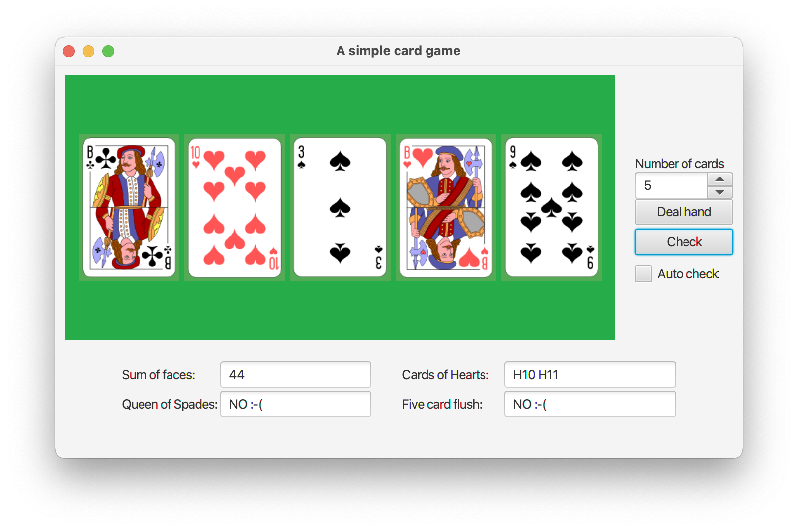

##A Simple Card game
Dette er løsningsforslag til Obligatorisk innlevering #3 i IDATx2001 våren 2021.
Oppgaven gikk ut på å lage et enkelt kortspill, der det skulle utføres 4 sjekker av kortene som er delt ut på hånd:
* Summere verdiene til kortene
* Sjekke om spar dame er tilstede
* Returnere alle kort av hjerter
* Sjekke om du har oppnådd five-card-flush (5 kort eller fler med samme farge. Med "farge" menes i kortsammenheng "Spar", "Ruter", "Kløver" og "Hjerter".)

Implementert løsningsforslag:
* Er configurert for Java 11 og JavaFX 15.0.1
* For JUnit5 testing, benyttes v5.7.1 av Jupiter, og v3.0.0-M5 fro surfire-plugin.
* Er laget ved bruk av FXML for å designe GUI, der klassen **MainWindowController** er Controller-klassen til hovedvinduet.
* Presenterer kortene grafisk. Samtlige kort i kortstokken finnes i ett enkelt bilde (filen *playingcards.png*) som hvert enkelt kort klippes ut fra.
* Den grafiske representasjonen av et kort tilhører **brukergrensesnittet**. Du vil derfor ikke finne at klassen **PlayingCard** inneholder et bilde. Bildene lagres i en **HashMap** i Controller-klassen, der nøkkelen er kortet som tekststreng.
* Inneholder en testklasse med 11 tester som tester klassen **HandOfCards**. Det burde også vært en testklasse på **DeckOfCards**.

